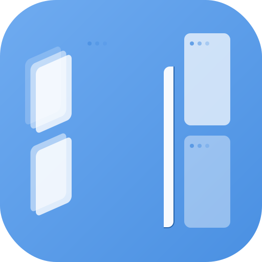
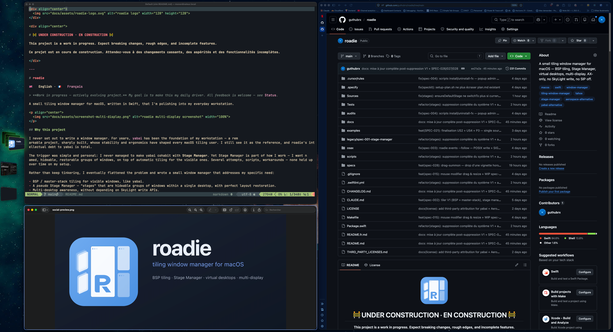

<div align="center">
  
</div>

<div align="center">

# Roadie

**Work in progress. Expect rough edges, breaking changes, and missing polish.**

English | [Français](README.fr.md)

</div>

Roadie is a small macOS tiling window manager written in Swift, built around one idea: automatic tiling and a Stage Manager-like workflow should be able to live together.

<p align="center">
  
</p>

## Why This Project Exists

I never set out to write a window manager. For years, [yabai](https://github.com/koekeishiya/yabai) has been the foundation of my macOS workstation: sharp, powerful, and deeply influential for anyone who cares about tiling on macOS. Roadie owes a lot to yabai, both functionally and culturally.

The trigger was personal: I never managed to make yabai coexist cleanly with the Stage Manager workflow I wanted. I wanted named, hideable, restorable groups of windows, while still keeping automatic tiling for the visible windows.

So Roadie focuses on that specific combination:

- `bsp`, `mutableBsp`, and `masterStack` tiling for the visible windows.
- Roadie stages: named groups of windows that can be hidden, restored, reordered, and represented visually.
- Roadie virtual desktops managed without controlling native macOS Spaces.
- Multi-display support where each display keeps its own current desktop, active stage, and layout.
- Display parking: when a monitor disappears, Roadie parks its non-empty stages on a remaining display instead of merging them into the active stage.

Roadie is not trying to replace yabai. yabai is broader, older, and much more mature. Roadie is intentionally smaller and opinionated around my workflow.

## The AeroSpace Influence

The second major influence is [AeroSpace](https://github.com/nikitabobko/AeroSpace).

Instead of trying to manipulate native macOS Spaces, Roadie follows the same broad direction: keep SIP on, avoid private write APIs, and manage virtual workspaces on Roadie's side. Switching a Roadie desktop means hiding windows from the outgoing desktop and restoring windows from the incoming one.

The result is a small hybrid:

- A tiling model inspired by yabai's practical macOS window-manager ergonomics.
- A virtual desktop model inspired by AeroSpace's refusal to fight native Spaces.
- A stage layer built for people who want a Stage Manager-like workflow on top of tiling.

If you need a mature general-purpose macOS WM, look at yabai or AeroSpace first. Roadie exists for the narrower case where tiling, virtual desktops, and stage groups need to be one workflow.

## Feature Positioning

This is not a superiority table. It is only meant to make Roadie's scope clear.

| Feature | yabai | AeroSpace | Roadie |
|---|---:|---:|---:|
| BSP tiling | yes | yes | yes |
| Master-stack layout | partial | yes | yes |
| Native macOS Spaces control | yes, with extra system setup | no | no |
| Virtual desktops without native Spaces | no | yes | yes |
| Named stages inside a desktop | no | no | yes |
| Stage rail with thumbnails | no | no | yes |
| Multi-display tiling | yes | yes | yes |
| Focus follows mouse | yes | yes | yes |
| Focus border overlay | no | no | yes |
| CLI-first operation | yes | yes | yes |

Roadie does not require disabling SIP. It uses Accessibility for window discovery and movement, and Screen Recording only for rail thumbnails.

## What Roadie Does Today

- Tiles visible windows with `bsp`, `mutableBsp`, `masterStack`, or `float` modes.
- Keeps stage groups per display and Roadie desktop.
- Provides Roadie virtual desktops without controlling native macOS Spaces.
- Supports multiple displays independently.
- Parks stages from a disconnected display on a remaining display, then restores them when the same display comes back and can be recognized safely.
- Shows a native side rail with stage thumbnails.
- Lets you drag thumbnails between stages or into the active workspace.
- Lets you optionally right-click a managed window title bar to send that window to another stage, desktop, or display.
- Shows a focus border around the active window.
- Provides keyboard-friendly CLI commands for BetterTouchTool, Karabiner, shell scripts, or any launcher.
- Persists stage membership and layout state across daemon restarts.
- Exposes state, health, metrics, events, and audit commands for debugging.
- Publishes JSONL automation events and stable `roadie query ...` JSON projections.
- Supports TOML window rules with validation, explain, runtime `rule.*` events, and automatic stage/display placement.
- Supports power-user layout commands such as `focus back-and-forth`, `layout insert`, `layout flatten`, and `layout zoom-parent`.
- Persists and exposes window groups for stack/tab-like workflows.
- Provides safety tools: atomic config reload, manual restore snapshots, limited restore-on-exit/crash watcher, generated-file cleanup.
- Exposes read-only performance diagnostics without instrumenting focus/border hot paths.

## Documentation

Full documentation is available in English and French:

- [English documentation](docs/en/README.md)
- [Documentation francaise](docs/fr/README.md)

Main guides:

- [Feature overview](docs/en/features.md)
- [CLI commands](docs/en/cli.md)
- [Configuration and rules](docs/en/configuration-rules.md)
- [Events and Query API](docs/en/events-query.md)
- [Use cases](docs/en/use-cases.md)

## Requirements

- macOS.
- Xcode Command Line Tools.
- Accessibility permission for `roadied`.
- Screen Recording permission if you want real window thumbnails in the rail.

Install Xcode Command Line Tools if needed:

```bash
xcode-select --install
```

## Build

From the repository root:

```bash
make test
make start
```

The project scripts force the Xcode toolchain and avoid shell environments that may inject incompatible linker flags.

## Manual Installation

For a local manual install from source, use:

```bash
make install
```

This hides the usual macOS service setup:

- builds `roadie` and `roadied` in release mode;
- installs them in `./bin` for this repository;
- also installs them in `~/.local/bin` for shell usage;
- ad-hoc signs both binaries;
- creates `~/Library/LaunchAgents/com.roadie.roadied.plist`;
- starts the LaunchAgent when it is not already loaded.

If Roadie is already running, `make install` does not stop it. Run this when you want the running daemon to reload the newly installed binaries:

```bash
make restart
```

If you only want to install files without starting the LaunchAgent:

```bash
ROADIE_INSTALL_NO_START=1 make install
```

Useful commands:

```bash
make test
make build
make install
make start
make stop
make restart
make status
make logs
make doctor
make dmg
```

Equivalent direct commands:

```bash
./scripts/test
./scripts/start
./scripts/stop
./scripts/status
./scripts/logs
./scripts/roadie daemon health
```

## DMG Build And Unsigned Installation

Roadie can be packaged as a classic macOS DMG:

```bash
make dmg
```

The output is:

```text
dist/Roadie.dmg
```

The DMG contains `Roadie.app` and an `/Applications` shortcut, so installation is the usual drag-and-drop flow.

Important: this build is ad-hoc signed, not Developer ID signed, and not notarized. That means macOS Gatekeeper will not treat it like a fully trusted public app.

For users, the expected first-run flow is:

1. Drag `Roadie.app` to `/Applications`.
2. Open it once with right click > Open, then confirm. Roadie starts as a background menu-less app.
3. If macOS still blocks it, run:

```bash
xattr -dr com.apple.quarantine /Applications/Roadie.app
```

4. Grant permissions to `/Applications/Roadie.app` in System Settings > Privacy & Security:

- Accessibility.
- Screen Recording, if live nav rail thumbnails are wanted.

This limitation is normal until the app is signed with an Apple Developer ID certificate and notarized by Apple.

The packaged app currently starts Roadie for the current user session. A future signed installer can add a login item or LaunchAgent automatically; for now, startup-at-login is intentionally left explicit.

## Permissions

Roadie needs Accessibility permission to read and move windows.

After building and starting the daemon, add this binary in System Settings > Privacy & Security > Accessibility:

```text
/Users/moi/Nextcloud/10.Scripts/39.roadie/bin/roadied
```

Then restart the daemon:

```bash
make restart
```

Screen Recording is optional but recommended. Without it, the nav rail may show fallback app icons instead of live thumbnails.

## Configuration

The user configuration file is:

```text
~/.config/roadies/roadies.toml
```

Validate it with:

```bash
./bin/roadie config validate
```

Inspect the loaded configuration:

```bash
./bin/roadie config show
```

Validate and inspect rules:

```bash
./bin/roadie rules validate --config ~/.config/roadies/roadies.toml
./bin/roadie rules list --json
./bin/roadie rules explain --app Terminal --title roadie --role AXWindow --stage dev
```

## Daily Use

Start or restart the daemon:

```bash
make restart
```

Check the runtime state:

```bash
./bin/roadie daemon health
./bin/roadie state audit
./bin/roadie metrics
./bin/roadie tree dump
```

List windows and displays:

```bash
./bin/roadie windows list
./bin/roadie display list
```

Switch layout mode for the current stage:

```bash
./bin/roadie mode bsp
./bin/roadie mode mutableBsp
./bin/roadie mode masterStack
./bin/roadie mode float
```

Move focus or windows:

```bash
./bin/roadie focus left
./bin/roadie focus right
./bin/roadie focus back-and-forth
./bin/roadie move left
./bin/roadie warp right
./bin/roadie resize left
./bin/roadie display focus right
```

Move the focused window to another display:

```bash
./bin/roadie window display 2
```

## Stages

Stages are groups of windows. Only the active stage is visible; inactive stages are hidden and represented in the nav rail.

Common commands:

```bash
./bin/roadie stage list
./bin/roadie stage create 4
./bin/roadie stage rename 4 Comms
./bin/roadie stage switch 2
./bin/roadie stage assign 2
./bin/roadie stage switch-position 2
./bin/roadie stage assign-position 2
./bin/roadie stage switch-visible next
./bin/roadie stage switch-visible prev
./bin/roadie stage assign-empty
./bin/roadie stage reorder 2 1
./bin/roadie stage delete 4
./bin/roadie stage prev
./bin/roadie stage next
```

`stage switch` and `stage assign` target stable stage IDs. `stage switch-position`
and `stage assign-position` target the visible order in the nav rail, so position
1 is the first visible stage even if its internal ID is different.
`stage switch-visible prev|next` cycles through non-empty stages only, matching
the nav rail order. `stage assign-empty` sends the active window to the next
unnamed empty stage, creating one if needed.

Bring an inactive-stage window back into the active stage:

```bash
./bin/roadie stage summon WINDOW_ID
```

Move the active stage to another display:

```bash
./bin/roadie stage move-to-display 2
./bin/roadie stage move-to-display right
./bin/roadie stage move-to-display right --no-follow
```

Without a flag, Roadie uses `[focus].stage_move_follows_focus`. `--follow` and
`--no-follow` override that preference for one command. The nav rail also exposes
the same operation from a stage card context menu.

## Roadie Desktops

Roadie desktops are virtual desktops managed by Roadie. They do not create, switch, or control native macOS Spaces.

```bash
./bin/roadie desktop list
./bin/roadie desktop current
./bin/roadie desktop focus 2
./bin/roadie desktop focus next
./bin/roadie desktop focus prev
./bin/roadie desktop focus back
./bin/roadie desktop back-and-forth
./bin/roadie desktop summon 3
./bin/roadie desktop label 2 DeepWork
```

## Power-User Layout Commands

```bash
./bin/roadie layout split horizontal
./bin/roadie layout split vertical
./bin/roadie layout insert right
./bin/roadie layout join-with left
./bin/roadie layout flatten
./bin/roadie layout zoom-parent
```

These commands persist layout intent where applicable, so the maintainer does not immediately undo deliberate manual structure.

## Window Groups

```bash
./bin/roadie group create terminals 12345 67890
./bin/roadie group add terminals 11111
./bin/roadie group focus terminals 67890
./bin/roadie group remove terminals 12345
./bin/roadie group dissolve terminals
./bin/roadie group list
```

Groups are persisted in Roadie's stage state and exposed through `roadie query groups`.

## Automation

Subscribe to live events:

```bash
./bin/roadie events subscribe --from-now --initial-state
```

Read stable JSON projections:

```bash
./bin/roadie query state
./bin/roadie query windows
./bin/roadie query displays
./bin/roadie query desktops
./bin/roadie query stages
./bin/roadie query groups
./bin/roadie query rules
./bin/roadie query health
./bin/roadie query events
```

Move the focused window to another Roadie desktop:

```bash
./bin/roadie window desktop 2
./bin/roadie window desktop 2 --follow
```

## Nav Rail

The nav rail is a native per-display side panel.

It shows non-empty stages, live thumbnails when available, fallback app icons when capture is unavailable, and a halo around the active stage.

Supported interactions:

- Click a stage thumbnail stack to switch stage.
- Click empty rail space to hide the active stage and switch to an empty stage. This can be disabled with `empty_click_hide_active = false`.
- Drag a thumbnail to another stage to move that window there.
- Drag a thumbnail into the active workspace to summon it.
- Drag a thumbnail to an empty rail area to place it in an empty or newly created stage.
- Drag an application window by its title bar onto a stage to move it there.
- Drag an application window by its title bar onto empty rail space to place it in an empty or newly created stage.
- Use the chevrons above and below a stage to reorder stages.
- Clicks in macOS-reserved areas such as the menu bar are ignored by rail empty-click handling.

Rail rendering is configured in `~/.config/roadies/roadies.toml`.

## Troubleshooting

Run the quick health checks:

```bash
./bin/roadie daemon health
./bin/roadie state audit
./bin/roadie self-test
```

Repair conservative state issues:

```bash
./bin/roadie state heal
./bin/roadie daemon heal
```

Inspect logs and events:

```bash
make logs
./bin/roadie events tail 50
```

If windows stop moving after a rebuild, re-check Accessibility for `bin/roadied`, then restart:

```bash
make restart
```

## Repository Layout

```text
Sources/RoadieAX       Accessibility and system window snapshots
Sources/RoadieCore     Shared types, geometry, config
Sources/RoadieTiler    Pure layout strategies
Sources/RoadieStages   Persistent Roadie desktop and stage state
Sources/RoadieDaemon   Daemon services, rail, border, commands
Sources/roadie         CLI
Sources/roadied        Daemon entry point
Tests                  Unit tests
scripts                Build and runtime helpers
```

## Status

Roadie is built for personal daily use first. Expect changes in command shape, configuration keys, and rail behavior while the project stabilizes.
